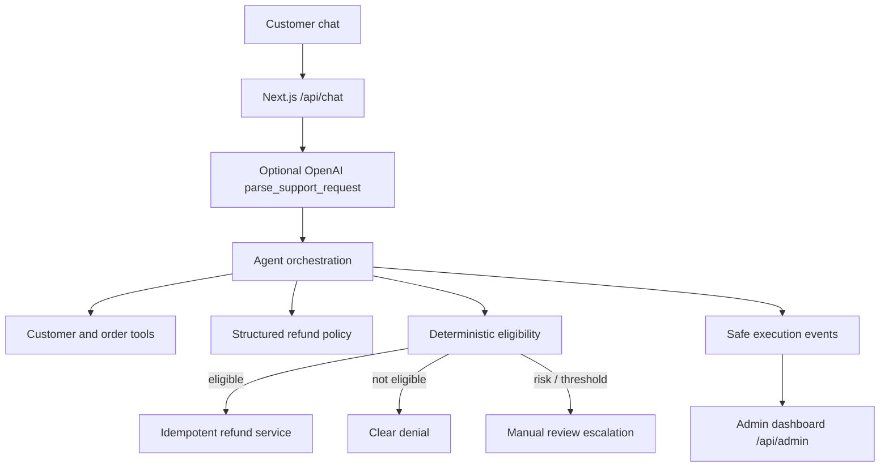

# AI Customer Support Agent

RefundAI is a polished customer-support and operations demo for e-commerce refunds. It combines a Next.js chat experience, an optional OpenAI function call for natural-language intent parsing, and deterministic server-side policy enforcement. The refund demo works without an API key.

## Features

- Customer-facing chat with account selection, recent-order lookup, quick demo scenarios, loading states, and decision badges.
- A live operations dashboard with refund metrics, recent conversations, policy summary, and safe agent execution logs.
- Mock CRM records for 15 distinct customers and 20 varied orders.
- Server-side order ownership checks, structured policy lookup, deterministic eligibility, escalation, and idempotent mock refund processing.
- Optional OpenAI function calling for request intent/order-ID parsing. The model cannot authorize or process a refund.
- API validation with Zod and deterministic tests for policy and refund behavior.

## Architecture



## Agent workflow

1. Validate the selected customer and message on the server.
2. Interpret intent and extract an order ID. With `OPENAI_API_KEY`, the server requests the `parse_support_request` function tool. Without a key or when the provider fails, deterministic parsing keeps the demo available.
3. Retrieve customer/order records and structured refund policy rules through server data tools.
4. Verify ownership, delivery status, the 30-day window, product eligibility, item condition, previous refunds, and account risk.
5. Deny failed mandatory checks, escalate high-risk or high-value cases, and process only requests that pass every check.
6. Return a customer-friendly result and safe execution events. Logs show outcomes and policy checks, never private chain-of-thought.

## Tools and business services

- `getCustomer(customerId)` — customer profile lookup.
- `getOrder(orderId)` — order record lookup.
- `getCustomerOrders(customerId)` — recent order lookup.
- `getRefundHistory(customerId)` — seeded refund count plus refunds processed in this session.
- `refundPolicy` — structured, versioned refund rules.
- `validateEligibility(order, customerId, now)` — deterministic policy enforcement.
- `amountFor(order)` — cent-precision refund amount.
- `processRefund(order, customerId)` — ownership-checked, idempotent mock refund operation.
- `handleChat(request)` — orchestrates intent, retrieval, policy checks, decision, action, and execution events.
- `GET /api/admin` — dashboard metrics, activity, customers, orders, and refund records.

The demo data store is process memory. On a serverless host such as Vercel, separate function instances may not share that memory. The active browser session merges its own chat results into the dashboard so the current demo trace and metrics update, but the data is not durable across browser reloads, cold starts, or redeployments. A production service would use a durable database, authenticated customer sessions, and shared idempotency storage.

## Refund policy

- A request must be made within 30 calendar days of delivery.
- The order must be delivered and belong to the selected customer account.
- Digital, gift card, personalized, and final-sale products are not refundable.
- Products must be unused and resellable, except eligible defective-item claims.
- An order can be refunded only once.
- Refunds above $250 and high-risk accounts or accounts with at least four historical refunds go to manual review.
- Failed mandatory checks deny automatic refund; no payment operation is attempted.

Rules are available in `src/data/refund-policy.ts`; operational thresholds live in `src/data/refund-config.ts`.

## Demo scenarios

- **Approved:** Olivia Bennett (`CUS-1001`) requests a refund for `ORD-1001` ($129.99). Its delivery date is seeded five days before the current date, so it remains inside the return window. The mock refund is processed once.
- **Denied:** Lucas Anderson (`CUS-1010`) requests a refund for `ORD-1010`. Its delivery date is seeded 53 days before the current date, outside the return window.
- **Escalated:** Ava Thompson (`CUS-1005`) has a high-risk profile; a request for `ORD-1016` is sent to manual review.
- Additional records cover already-refunded, non-refundable, shipped, cancelled, defective, and high-value orders.

The demo scenarios are shown as buttons in the live agent preview. Refund records and conversations are stored in memory and reset when the server restarts.

## Admin dashboard

The Overview displays live totals, recent conversations, a short policy summary, and a 2.5-second polling feed of the latest agent execution. The active browser session merges chat results into these views to accommodate serverless function isolation. Events describe verifiable operations, such as customer lookup, policy retrieval, window check, eligibility decision, escalation, and refund processing. The dashboard is a demo operations surface, not an authenticated production admin console.

## Tech stack

- Next.js 15 App Router, React 19, TypeScript strict mode
- Custom responsive CSS and Lucide icons
- Zod request validation
- Native Node test runner with `tsx`
- OpenAI Chat Completions function calling (optional, server-side only)

## Project structure

```text
src/
  app/                  Next.js UI, global styles, API routes
  data/                 Customer/order seeds, policy, shared types
  server/               Agent orchestration, config, in-memory data store
tests/                  Deterministic policy and service tests
```

## Environment variables

Copy `.env.example` to `.env.local` if you want OpenAI-powered request parsing:

```dotenv
OPENAI_API_KEY=your_server_side_key
OPENAI_MODEL=gpt-4o-mini
```

Both values are optional. No API key is sent to the browser. When model parsing is unavailable, the deterministic parser handles the demo and all business decisions remain deterministic.

## Local development

```bash
npm install
npm run dev
```

Open https://ai-customer-support-ebon.vercel.app/

## Testing and checks

```bash
npm test
npm run lint
npm run typecheck
npm run build
```

## AI usage and design decisions

AI is an optional natural-language parser only. It returns a bounded structured intent and possible order identifier through a function call. A model-provided order identifier must also appear in the customer's original message before it is used. The selected customer account, CRM facts, policy, refund amount, eligibility, and refund action are controlled by server code. This separation keeps the agent useful while making money-related outcomes reproducible and auditable.

Voice interaction is not implemented. No non-functional voice controls are shown.
